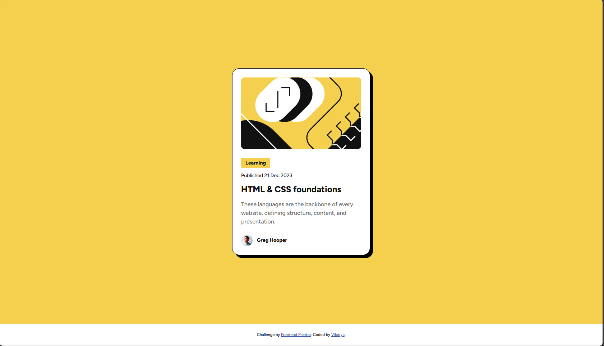

# Frontend Mentor - Blog preview card solution

This is a solution to the [Blog preview card challenge on Frontend Mentor](https://www.frontendmentor.io/challenges/blog-preview-card-ckPaj01IcS). Frontend Mentor challenges help you improve your coding skills by building realistic projects. 

## Table of contents

- [Overview](#overview)
  - [The challenge](#the-challenge)
  - [Screenshot](#screenshot)
  - [Links](#links)
- [My process](#my-process)
  - [Built with](#built-with)
  - [What I learned](#what-i-learned)
- [Author](#author)

**Note: Delete this note and update the table of contents based on what sections you keep.**

## Overview

### The challenge

Users should be able to:

- See hover and focus states for all interactive elements on the page

### Screenshot



### Links

- Solution URL: [solution URL](https://github.com/Vilodya/blog-preview-card-main)
- Live Site URL: [live site URL](https://vilodya.github.io/blog-preview-card-main/)

## My process

### Built with

- Semantic HTML5 markup
- CSS custom properties
- Flexbox
- CSS Grid

**Note: These are just examples. Delete this note and replace the list above with your own choices**

### What I learned

I’ve learned how and when to use 100% height, which I rarely used before.

```css
.card__image-wrapper {
  height: 200px;
  border-radius: 10px;
  overflow: hidden;
}

.card__image {
  height: 200px;
  width: 100%;
  object-fit: cover;
  object-position: center center;
}
```

## Author

- Website - [LinkedIn](https://www.linkedin.com/in/vladimir--denisov)
- Frontend Mentor - [@Vilodya](https://www.frontendmentor.io/profile/Vilodya)
